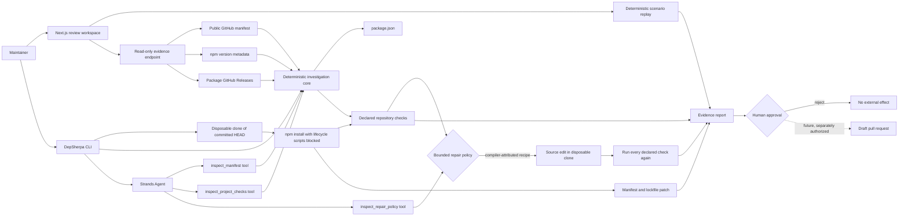

# Architecture

DepSherpa keeps reasoning, deterministic repository inspection, command execution, and external effects in separate trust zones.

## Trust boundaries

### Deterministic core

`src/core` owns facts that should not depend on a model: manifest parsing, semantic-version classification, check discovery, bounded process execution, and report rendering.

### Strands orchestration

`src/agent/strands.ts` gives the model three read-only tools for manifest facts, declared checks, and the immutable repair policy. The system prompt requires tool evidence, distinguishes facts from hypotheses, and keeps the final human decision explicit. The model cannot execute commands or mutate files through these tools.

### Command runner

The CLI executes only four script names already declared by the inspected repository: `lint`, `typecheck`, `test`, and `build`. DepSherpa spawns npm with `shell: false`, captures bounded output, sets `CI=1`, and terminates the process group when a command exceeds its timeout. npm still executes repository scripts with normal npm semantics, so the first release requires a repository the operator trusts and does not claim OS-level network or filesystem isolation. The isolated `upgrade` path requires an npm Git root, clones committed `HEAD` without hardlinks, disables npm lifecycle scripts, compares baseline and candidate checks, and captures only manifest/lockfile changes. The temporary clone is removed unless the operator explicitly requests retention.

### Bounded repair policy

Repair is a separate opt-in capability. The first deterministic recipe consumes an exact TypeScript diagnostic for the documented Zod 3→4 property migration, confirms that the diagnosed tracked source file imports Zod, and edits only the referenced line. A fixed policy caps the proposal at three allowed source files and twelve source lines and rejects tests, fixtures, migrations, configuration, and unexplained file changes. The complete patch is captured before verification; all declared checks run again, and any verification-time patch mutation prevents a verified result. Future Strands-generated proposals must enter through this same policy boundary rather than receiving direct filesystem tools.

### Hosted evidence intake

`app/api/investigate/route.ts` accepts a GitHub repository root URL, a path ending in `package.json`, a lowercase npm package name, and an exact target version. It calls only fixed GitHub and npm HTTPS origins, parses the fetched manifest as data, and returns a read-only report. When npm declares a GitHub source repository, it scans the 50 most recent public Releases, semantically matches records inside the requested upgrade range, and retains at most six bounded excerpts with source links. It has no filesystem, command-execution, credential, or mutation capability.

### External effects

There is no implementation path for branch pushes, pull requests, messages, or account changes. The dotted future edge in the diagram must remain behind a separate approval token if implemented.

## Demo flow

The hosted web experience offers two labeled modes. The live path reads real public manifest and npm metadata but stops before code execution. The synthetic Zod v3-to-v4 replay demonstrates the later execution, repair, and approval states without AWS credentials. Simulated command results are never presented as measurements from the live repository.
