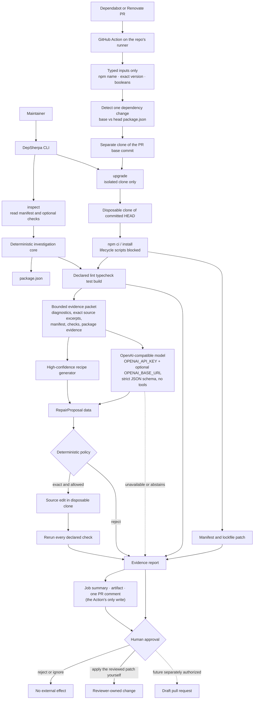

# Architecture

DepSherpa keeps proposal generation, deterministic policy, isolated execution, and external effects in separate trust zones. This diagram matches the shipped code: a GitHub Action as the entry point, a CLI sharing the same core for local reproduction, one isolated runner shared by both, high-confidence recipe proposal generators, a no-tool model proposal step over any OpenAI-compatible endpoint, deterministic validation, and a human approval gate. The only external write is the Action's report comment.

```text
Dependabot / Renovate pull request
→ GitHub Action on the repository's own runner (permissions: contents read · pull-requests write)
→ Detect the single changed dependency from base vs head package.json
→ Check out the PR base commit into a separate clone
→ The same src/core upgradeInIsolation the CLI calls
→ Upgrade, checks, proposal generation, policy, and verification in a disposable clone
→ Job summary + report artifact + one PR comment; the reviewer decides
```



## Surfaces

| Surface | What it does | What it never does |
| --- | --- | --- |
| GitHub Action (`action.yml`, `src/action`) | On a dependency PR (or `workflow_dispatch` inputs), checks out the base commit separately, runs the isolated upgrade with optional repair, writes the job summary and `depsherpa-report` artifact, and creates or updates one PR comment | Commit, push, apply the patch to the checkout, fail the workflow on a verdict, or accept commands/scripts/executables as inputs |
| CLI `inspect` | Read `package.json`, classify the jump, optionally run declared checks | Change files or create a commit |
| CLI `upgrade` | Copy committed `HEAD`, apply an exact npm target, compare checks, optionally request and validate a bounded proposal | Touch the source repository, give the model write tools, commit, push, or open a PR |

## Trust boundaries

### Deterministic core

`src/core` owns facts that should not depend on a model: manifest parsing, semantic-version classification, check discovery, bounded process execution, isolated upgrades, and report rendering.

### Model proposals

`src/agent/openai.ts` is the only model integration. `resolveModelConfig` picks the endpoint from the environment: `OPENAI_API_KEY` (with optional `OPENAI_BASE_URL` and `DEPSHERPA_MODEL`) selects any OpenAI-compatible provider; nothing configured means no request. The GitHub Actions token is never used as a model credential: GitHub Models, the only zero-configuration inference Actions offered, was retired on 2026-07-30. The generator receives a serialized, bounded evidence packet prepared by the deterministic core, sends it with a strict JSON schema (falling back to `json_object` for providers that reject it), and validates the answer with Zod into either a `RepairProposal` or an abstention. The model has no tools: it cannot browse files, execute commands, mutate files, write to GitHub, commit, push, or open a pull request. Endpoint, credential, or schema failures become `agent_unavailable`; no edit is applied.

### GitHub Action

`action.yml` is a composite action: it installs DepSherpa's runtime dependencies into the action path, runs `scripts/action.ts` with the inputs mapped to environment variables, and uploads `report-dir` as an artifact. `src/action/run.ts` orchestrates one run: `inputs.ts` parses the typed inputs, `context.ts` reads the pull-request payload, `detect.ts` derives the single dependency change from the base and head manifests, `source.ts` fetches the base commit by SHA when the checkout is shallow and clones it into a temporary directory through a short-lived local branch, the core's `upgradeInIsolation` runs against that clone, `comment.ts` renders the compact PR comment and `GITHUB_OUTPUT` assignments, and `github.ts` creates or updates the single marked comment. Verdicts never fail the job.

### Command runner

The Action and the CLI execute only four script names already declared by the inspected repository: `lint`, `typecheck`, `test`, and `build`. DepSherpa spawns npm with `shell: false`, captures bounded diagnostic output, sets `CI=1`, removes caller-directory hints from the child environment, and terminates the process group when a command exceeds its timeout. npm still executes repository scripts with normal npm semantics, so the first release requires a repository the operator trusts and does not claim OS-level network or filesystem isolation. The isolated `upgrade` path requires an npm Git root, clones committed `HEAD` without hardlinks, removes the source `origin` before project code runs, disables npm lifecycle scripts, compares baseline and candidate checks, and captures the complete final diff. The temporary clone is removed unless the operator explicitly requests retention.

### Bounded repair policy

Repair is a separate opt-in capability. Recipes and the model can only generate `RepairProposal` data. Each `RepairEdit` contains a normalized repository-relative path, exact expected text, replacement, rationale, and the exact diagnostic it relies on. The deterministic policy rejects traversal and absolute paths, untracked or symlinked files, binary/invalid UTF-8 content, tests, fixtures, migrations, configuration, unsupported extensions, contexts the generator did not receive, ambiguous or stale expected text, overlapping edits, more than three files, and more than twelve changed lines.

Only after that validation does the core re-read the files and apply exact replacements in the disposable clone. It captures the complete patch before verification, reruns every declared check, compares the patch again afterward, and audits unexpected paths. Only all-green checks with no unexpected change produce `verified`. Recipe generation, model generation, unsupported evidence, policy rejection, failed verification, and successful verification remain separate report states. `verified` describes observed checks, not a guarantee that a model suggestion is semantically correct.

### External effects

The Action's single report comment is the only external write in the codebase. There is no implementation path for branch pushes, pull requests, patch application, or account changes. The dotted future edge in the diagram must remain behind a separate approval token if implemented.

## Evidence chain

1. Inventory: locate the dependency and classify the requested version jump.
2. Release evidence: the isolated runner retains the installed target package manifest and a bounded published migration/changelog excerpt when available.
3. Isolated upgrade: apply the exact target inside a disposable clone of committed `HEAD` (the pull request's base commit in the Action).
4. Diagnosis and context: compare baseline and candidate checks, retain bounded diagnostics, and read only attributable tracked source excerpts.
5. Proposal: use a high-confidence recipe when one matches; otherwise, if a model is configured, ask it for structured candidate data. Insufficient evidence or an unavailable endpoint stops safely.
6. Policy and isolated application: validate every edit deterministically and apply only exact, reproducible replacements in the disposable clone.
7. Verification and approval: rerun every declared check, reject unexpected changes, emit diagnostics, context summary, rationale, complete diff, and results, then wait. The Action publishes them as a summary, an artifact, and one comment; no source-repository write, commit, push, or pull request is created.

## Demo flow

Open a Dependabot-style pull request that bumps one dependency in a repository with the workflow from the README. The Action detects the change, checks out the base commit, runs the isolated upgrade on the runner, and leaves a comment with the baseline-versus-candidate table, diagnostics, repair provenance (recipe, model, or none), the candidate patch, and the human decision; the job summary and the `depsherpa-report` artifact hold the complete report. With an `openai-api-key` secret configured, non-recipe failures may receive a model proposal; without it the report records `agent_unavailable` and the recipes still run.

The same run is reproducible offline: `npm run demo:repair` performs the real Zod recipe demonstration from the terminal. The generic non-recipe loop is covered by the Monaco-style test named `validates, applies, and verifies a non-recipe Agent proposal`; it injects structured model output so the complete policy/application/verification story can run without any network access.
