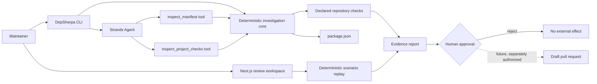

# Architecture

DepSherpa keeps reasoning, deterministic repository inspection, command execution, and external effects in separate trust zones.

## Trust boundaries

### Deterministic core

`src/core` owns facts that should not depend on a model: manifest parsing, semantic-version classification, check discovery, bounded process execution, and report rendering.

### Strands orchestration

`src/agent/strands.ts` gives the model two read-only tools. The system prompt requires tool evidence, distinguishes facts from hypotheses, and keeps the final human decision explicit. The model cannot execute commands or mutate files through these tools.

### Command runner

The CLI executes only four script names already declared by the inspected repository: `lint`, `typecheck`, `test`, and `build`. It uses `shell: false`, captures bounded output, sets `CI=1`, and terminates commands that exceed the configured timeout.

### External effects

There is no implementation path for branch pushes, pull requests, messages, or account changes. The dotted future edge in the diagram must remain behind a separate approval token if implemented.

## Demo flow

The hosted web experience replays a synthetic Zod v3-to-v4 migration. It is intentionally deterministic so reviewers can inspect every state without AWS credentials. The same state names map to the planned production workflow, but its simulated command results are never presented as measurements from a real repository.
